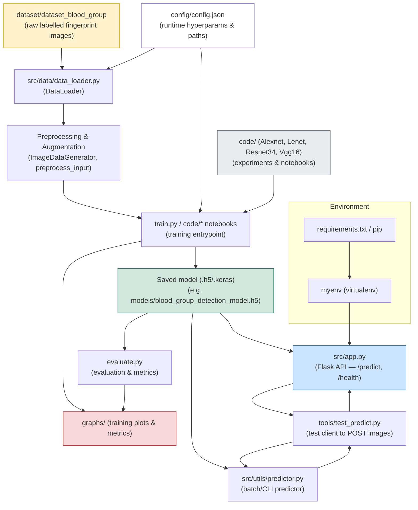

# BloodDetection — Project Workflow

This document describes the end-to-end workflow of the BloodDetection project and includes a Mermaid flowchart that visualizes how data, code, models and tools interact.

## Mermaid diagram (project workflow)



## Quick project overview

- Data: `dataset/dataset_blood_group/` — images arranged by blood-group folders (A+, A-, AB+, ...).
- Data loader: `src/data/data_loader.py` — builds a DataFrame of filepaths/labels, produces train/validation generators using Keras `ImageDataGenerator` and `preprocess_input`.
- Models: `src/models/resnet.py` — ResNet50-based model definition and compile helper.
- Training: `train.py` or notebooks under `code/` run training, save best model to disk and write training graphs to `graphs/`.
- Evaluation: `evaluate.py` consumes saved model, runs evaluation and outputs metrics/plots (`graphs/`).
- Prediction: `src/utils/predictor.py` for CLI/batch predictions, `src/app.py` exposes a Flask API with `/predict` and `/health` endpoints. `tools/test_predict.py` is a small client to test the API.
- Config: `config/config.json` centralizes dataset paths, model settings and training hyperparameters.

## How to view the Mermaid diagram

- GitHub: GitHub renders Mermaid in markdown files (if supported) or via special previewers. If Mermaid is not rendered, copy the code block into an online Mermaid live editor (https://mermaid.live/) or use a local VS Code extension ("Markdown Preview Mermaid Support").

## Quick start (Windows PowerShell)

Open PowerShell from the project root and run:

```powershell
# activate virtualenv
.\myenv\Scripts\Activate.ps1

# install deps
pip install -r requirements.txt

# run Flask API locally (default port 5000)
python src/app.py

# test with the included client (from project root)
python tools/test_predict.py "dataset/dataset_blood_group/A+/some_image.BMP"
```

Notes:
- If `src/app.py` cannot find a model, set `MODEL_PATH` env var to the saved `.h5` model path.
- TensorFlow on Windows can be sensitive to Python and VS runtime versions — see `myenv`/`README.md` for troubleshooting steps.

## Files & important locations

- `dataset/` — raw dataset folder
- `src/data/data_loader.py` — data loader and generator creation
- `src/models/` — model definitions (ResNet)
- `code/` — experiment notebooks (Alexnet, Lenet, Resnet34, Vgg16)
- `graphs/` — generated training/validation plots
- `models/` or `test/` — saved model artifacts (.h5)
- `src/app.py` — Flask API server
- `tools/test_predict.py` — small HTTP client for `/predict`
- `config/config.json` — central configuration

## Next steps I can help with

- Add a diagram image (SVG/PNG) generated from the Mermaid source and embed it in README.
- Add CLI wrapper commands (`make`, `invoke`, or small `scripts/`) for common tasks: train, evaluate, serve, predict.
- Create a Dockerfile and `docker-compose.yml` to run the API and optionally a model worker.

---

File created at: `PROJECT_WORKFLOW_README.md`

If you'd like the diagram in a different Mermaid style or with additional nodes (e.g., GPU training, CI/CD, Docker), tell me which details to include and I'll update it.